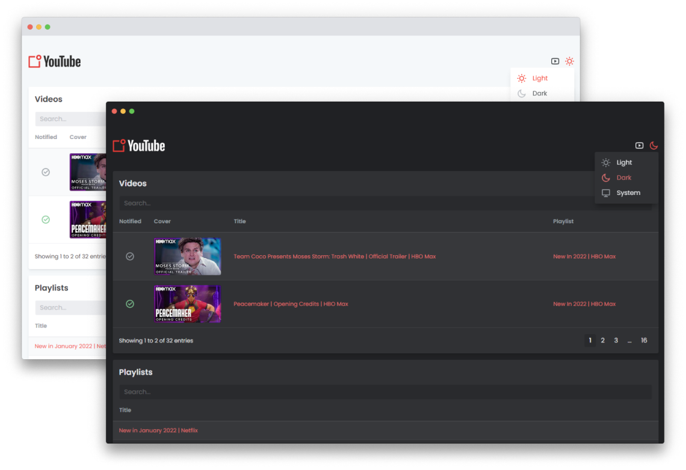

<p align="center">
    
</p>

<p align="center">
    <h1 align="center">YouTube Playlist Notifications</h1>
</p>

YouTube Playlist Notifications é um projeto criado para uso pessoal, no qual tem como objetivo enviar notificações via e-mail quando um novo vídeo é publicado em uma playlist do YouTube.

# Backend

## Cron

As rotinas serão executadas todos os dias no período configurado.

-   **Rotina que busca os vídeos no YouTube:** 00h00, 06h00, 12h00 e 18h00
-   **Rotina que envia notificação:** 00h15, 06h15, 12h15 e 18h15.

As configurações poderam ser alteradas no arquivo `.env`.

## Inicializar

Você precisará renomear o arquivo `.env.example` para `.env` e configurar as informações de SMTP.

```bash
git clone https://github.com/deivesfahl/nodejs-youtube-playlist-notifications

$ cd backend
$ npm install
$ npm run dev
```

## Banco de Dados

O projeto está utilizando o ORM [Prisma](https://www.prisma.io/) em conjunto com a biblioteca [SQLite](https://www.prisma.io/docs/concepts/database-connectors/sqlite). As configurações podem ser alteradas em `prisma/schema.prisma`.

```bash
$ cd backend
$ npx prisma migrate dev
```

# Backend - API

A API ficará acessível através da URL **http://localhost:3000**. A porta poderá ser alterada no arquivo `.env`.

## Rotas de Playlists

```http
GET /api/playlists
```

| Local   | Parâmetro | Tipo     | Descrição      |
| :------ | :-------- | :------- | :------------- |
| `query` | `id`      | `string` | ID da playlist |

```http
GET /api/playlists/:id/informations
```

| Local   | Parâmetro | Tipo     | Descrição                      |
| :------ | :-------- | :------- | :----------------------------- |
| `param` | `id`      | `string` | ID da playlist - `obrigatório` |

```http
POST /api/playlists
```

| Local  | Parâmetro | Tipo     | Descrição                          |
| :----- | :-------- | :------- | :--------------------------------- |
| `body` | `title`   | `string` | Título da playlist - `obrigatório` |
| `body` | `url`     | `string` | URL da playlist - `obrigatório`    |

```http
PUT /api/playlists/:id
```

| Local   | Parâmetro | Tipo     | Descrição                          |
| :------ | :-------- | :------- | :--------------------------------- |
| `param` | `id`      | `string` | ID da playlist - `obrigatório`     |
| `body`  | `title`   | `string` | Título da playlist - `obrigatório` |

```http
DELETE /api/playlists/:id
```

| Local   | Parâmetro | Tipo     | Descrição                      |
| :------ | :-------- | :------- | :----------------------------- |
| `param` | `id`      | `string` | ID da playlist - `obrigatório` |

## Rotas de Vídeos

```http
GET /api/videos
```

| Local   | Parâmetro    | Tipo     | Descrição      |
| :------ | :----------- | :------- | :------------- |
| `query` | `id`         | `string` | ID do vídeo    |
| `query` | `playlistId` | `string` | ID da playlist |

```http
POST /api/videos
```

| Local  | Parâmetro    | Tipo     | Descrição                              |
| :----- | :----------- | :------- | :------------------------------------- |
| `body` | `title`      | `string` | Título - `obrigatório`                 |
| `body` | `url`        | `string` | URL - `obrigatório`                    |
| `body` | `imageUrl`   | `string` | URL da imagem - `obrigatório`          |
| `body` | `notify`     | `string` | Notificar (`S` ou `N`) - `obrigatório` |
| `body` | `playlistId` | `string` | ID da playlist - `obrigatório`         |

```http
PUT /api/videos/:id
```

| Local   | Parâmetro  | Tipo     | Descrição                   |
| :------ | :--------- | :------- | :-------------------------- |
| `param` | `id`       | `string` | ID do vídeo - `obrigatório` |
| `body`  | `title`    | `string` | Título                      |
| `body`  | `imageUrl` | `string` | URL da imagem               |
| `body`  | `notify`   | `string` | Notificar (`S` ou `N`)      |

```http
DELETE /api/videos/:id
```

| Local   | Parâmetro | Tipo     | Descrição                   |
| :------ | :-------- | :------- | :-------------------------- |
| `param` | `id`      | `string` | ID do vídeo - `obrigatório` |

# Frontend

## Layout

<p align="center">
    
</p>

## Inicializar

A interface ficará acessível através da URL **http://localhost:9000**. A porta poderá ser alterada no arquivo `package.json`.

```bash
$ cd frontend
$ npm install
$ npm start
```
